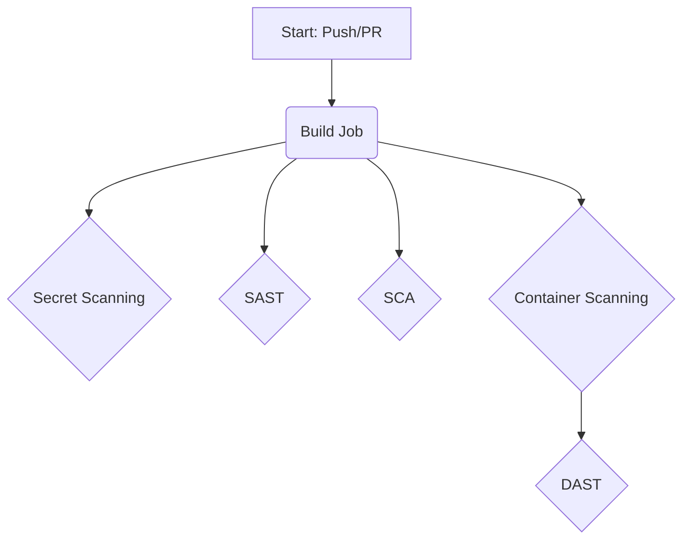

# DevSecOps Pipeline for OWASP Juice Shop

This project demonstrates a complete DevSecOps CI/CD pipeline for the OWASP Juice Shop application, implemented using GitHub Actions. The pipeline automatically scans the application for security vulnerabilities at various stages of the development lifecycle.

## Pipeline Architecture

The CI/CD pipeline is triggered on every push or pull request to the `main` branch. It consists of the following stages, which run in parallel after the initial build job:

### Pipeline Stages

1.  **Secret Scanning:**
    *   **Tool:** [TruffleHog](https://github.com/trufflesecurity/trufflehog)
    *   **Purpose:** Scans the repository's git history for any hardcoded secrets like API keys, passwords, or private keys. This prevents sensitive information from being exposed in the source code.

2.  **SAST (Static Application Security Testing):**
    *   **Tool:** [GitHub CodeQL](https://codeql.github.com/)
    *   **Purpose:** Analyzes the source code for potential security vulnerabilities without executing the application. It helps identify common coding mistakes that could lead to security flaws.

3.  **SCA (Software Composition Analysis):**
    *   **Tool:** [OWASP Dependency-Check](https://owasp.org/www-project-dependency-check/)
    *   **Purpose:** Scans the project's third-party dependencies for known vulnerabilities (CVEs). This is crucial as vulnerabilities in external libraries can be inherited by the application.

4.  **Container Scanning:**
    *   **Tool:** [Trivy](https://github.com/aquasecurity/trivy)
    *   **Purpose:** Scans the final Docker image for vulnerabilities in the base operating system and system libraries. This ensures that the entire containerized environment is secure.

5.  **DAST (Dynamic Application Security Testing):**
    *   **Tool:** [OWASP ZAP](https://www.zaproxy.org/)
    *   **Purpose:** Tests the running application for vulnerabilities by simulating real-world attacks. This helps find runtime vulnerabilities that cannot be detected by static analysis.

## How to View the Results

*   **Pipeline Runs:** The status of all pipeline runs can be viewed in the ["Actions" tab](https://github.com/louyyng/juice-shop/actions) of this repository.
*   **SAST (CodeQL) Results:** Vulnerabilities found by CodeQL are displayed in the ["Security" > "Code scanning" tab](https://github.com/louyyng/juice-shop/security/code-scanning).
*   **SCA and DAST Reports:** The detailed HTML reports from the OWASP Dependency-Check and OWASP ZAP scans are available as downloadable artifacts on the summary page of each successful workflow run.

This project showcases a practical implementation of DevSecOps principles, demonstrating how to build a robust, automated security pipeline to create more secure software.
